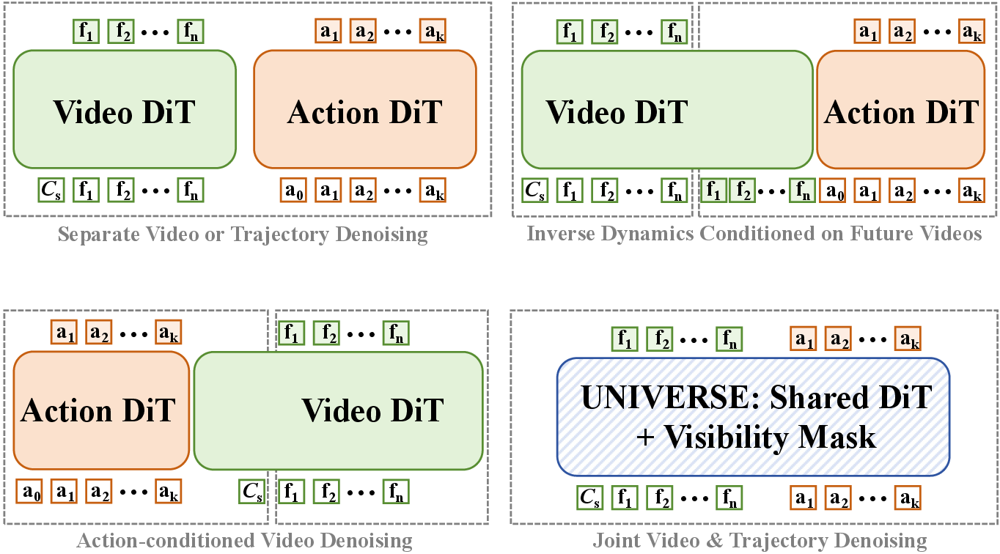
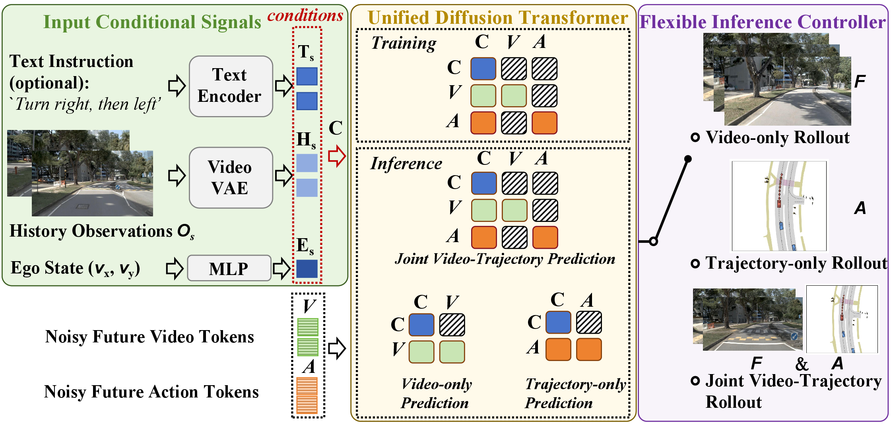
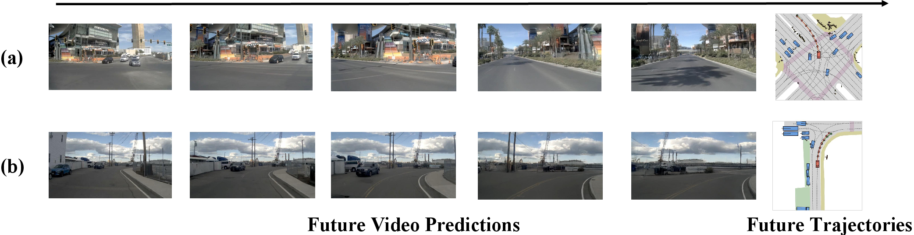
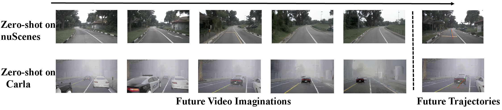

<div align="center">

# UNIVERSE

### Unified Video Action Models for Autonomous Driving with Flexible Mask-Modulated Modality Generation

**NeurIPS 2026**

[Paper](https://arxiv.org/abs/2607.05133) | [Checkpoint](https://huggingface.co/mengmengliu1998/UNIVERSE) | [Training](examples/wanvideo/UNIVERSE_train/README.md) | [Inference](examples/wanvideo/UNIVERSE_infer/README.md)

</div>

UNIVERSE extends DriveVA into a unified video-action model based on one
mask-modulated Diffusion Transformer. Future video latents and ego-trajectory
tokens are co-trained with shared parameters, while the Modality-Decoupling
Visibility Mask prevents leakage between future modalities. The same model
supports video-only, trajectory-only, and joint video-trajectory generation.

## Architecture

<div align="center">
<b>UNIVERSE shares video and trajectory denoising in a single DiT.</b>


<b>Overall pipeline and flexible inference modes.</b>

</div>

The visibility mask shares historical context across modalities but blocks
attention between future video and trajectory targets. At inference time, the
future token groups determine whether the model produces video, trajectory, or
both; the released planning launchers use trajectory-only inference by default.

## Qualitative Results

<div align="center">
<b>Joint future-video and trajectory prediction.</b>


<b>Zero-shot transfer from NavSIM to nuScenes and Bench2Drive.</b>

</div>

UNIVERSE is trained on NavSIM and evaluated on nuScenes and Bench2Drive without
target-dataset fine-tuning. See the paper for the complete quantitative results,
ablation studies, and evaluation protocol.

## Installation

Follow the repository [installation instructions](README.md#installation),
including the optional nuScenes devkit setup when running nuScenes inference.

## Model Preparation

Download Wan2.2 and the released UNIVERSE checkpoint to the default locations:

```bash
python -m pip install -U "huggingface_hub[cli]"

mkdir -p models/Wan-AI checkpoints

huggingface-cli download Wan-AI/Wan2.2-TI2V-5B \
  --local-dir models/Wan-AI/Wan2.2-TI2V-5B

huggingface-cli download mengmengliu1998/UNIVERSE step-200-ema.safetensors \
  --local-dir checkpoints

mv checkpoints/step-200-ema.safetensors checkpoints/UNIVERSE.safetensors
```

The inference launchers use `checkpoints/UNIVERSE.safetensors` and `models/`
by default. Override them with `FULL_CKPT` and `LOCAL_MODEL_PATH`.

## Training

UNIVERSE training uses NavSIM v1. Set the dataset paths and start distributed
training with:

```bash
export NAVSIM_LOG_PATH=/path/to/navsim_v1.1/navsim_logs/trainval
export SENSOR_BLOBS_PATH=/path/to/nuplan/dataset/nuplan-v1.1/sensor_blobs
export NUPLAN_MAPS_ROOT=/path/to/nuplan/dataset/maps
export NUPLAN_DATA_ROOT=/path/to/navsim_v1.1/dataset
export LOCAL_MODEL_PATH=$PWD/models

bash examples/wanvideo/UNIVERSE_train/scripts/train_dist_multi_node_navsim.sh
```

Training starts from the configured Wan2.2 base model unless `FULL_CKPT` is
set. To initialize from a full checkpoint, export its path before launching:

```bash
export FULL_CKPT=$PWD/checkpoints/UNIVERSE.safetensors
```

See the [training guide](examples/wanvideo/UNIVERSE_train/README.md) for
distributed settings, checkpoint output, automatic evaluation, and smoke tests.

## Inference

The released configuration uses three flow-matching sampling steps for all
three datasets. Run every dataset sequentially with:

```bash
bash examples/wanvideo/UNIVERSE_infer/scripts/infer_all.sh
```

Or run one dataset at a time:

```bash
bash examples/wanvideo/UNIVERSE_infer/scripts/eval_navsim_v1.sh
bash examples/wanvideo/UNIVERSE_infer/scripts/infer_nuscenes.sh
bash examples/wanvideo/UNIVERSE_infer/scripts/infer_bench2drive.sh
```

Dataset paths are supplied through environment variables or the YAML files in
`examples/wanvideo/UNIVERSE_infer/configs/`. See the
[inference guide](examples/wanvideo/UNIVERSE_infer/README.md) for the required
variables and output locations.

## Project Layout

| Path | Purpose |
| --- | --- |
| `examples/wanvideo/UNIVERSE_train/` | NavSIM v1 training and automatic evaluation |
| `examples/wanvideo/UNIVERSE_infer/` | NavSIM, nuScenes, and Bench2Drive inference |
| `diffsynth/pipelines/wan_video_new.py` | Shared video-action pipeline |
| `assets/universe_*.png` | Paper architecture and qualitative figures |

UNIVERSE and DriveVA share the Wan2.2-based pipeline, but use separate
checkpoints, launchers, configurations, temporary directories, and output
roots. UNIVERSE enables mixed latent attention masking in its entry points;
the DriveVA defaults remain unchanged.

## Citation

```bibtex
@article{liu2026universe,
  title={UNIVERSE: Unified Video Action Models for Autonomous Driving with Flexible Mask-Modulated Modality Generation},
  author={Liu, Mengmeng and Zhang, Diankun and Liu, Jiuming and Cui, Jianfeng and Xie, Hongwei and Chen, Guang and Ye, Hangjun and Nex, Francesco and Cheng, Hao and Yang, Michael Ying},
  journal={arXiv preprint arXiv:2607.05133},
  year={2026}
}
```

## Acknowledgments

UNIVERSE builds on the same open-source projects listed in the main
[acknowledgments](README.md#acknowledgments). The figures above are reproduced
from the UNIVERSE paper.
